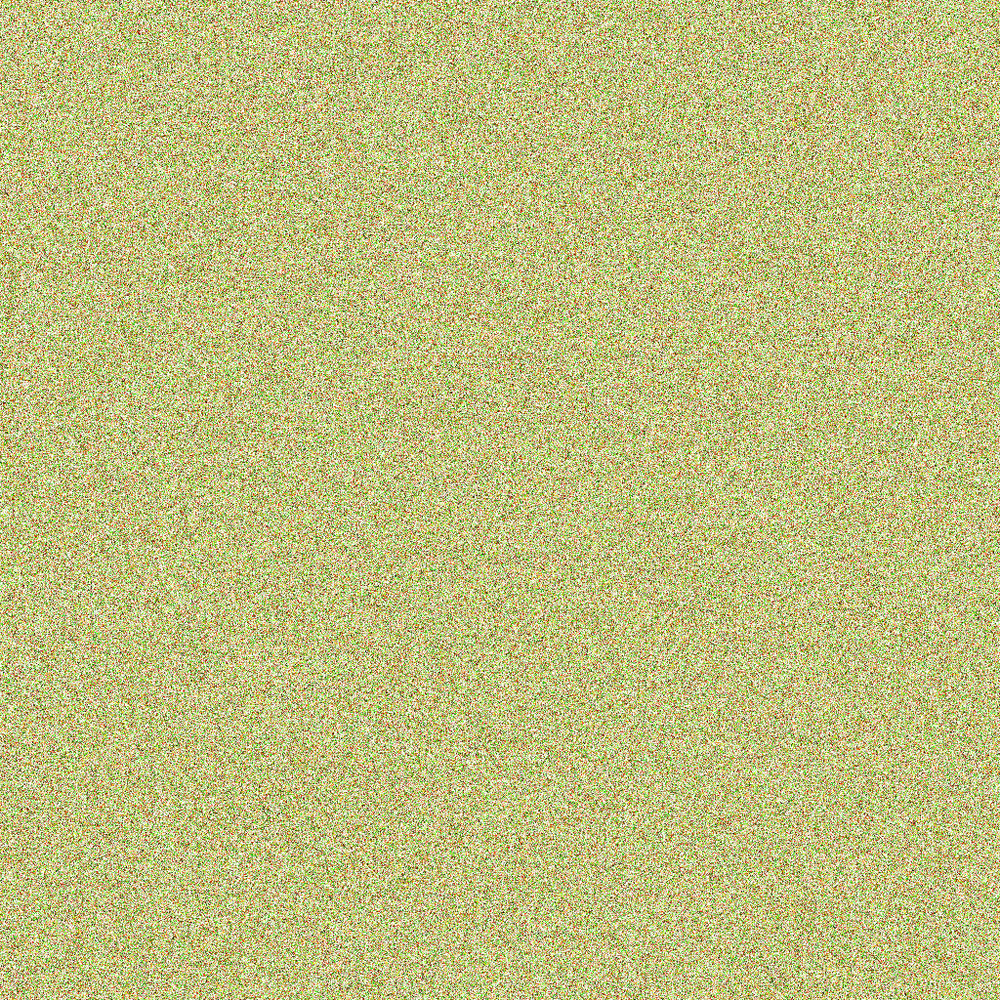

# xx-prng

### A seeded 32 bit counter prng based on the xxHash algorithm.

This is designed for procedural art or games where you may need to save or resume state from a different point in a render or level generation.

## Usage

### Generate seeded random functions

    import seeded from 'xx-prng/lib/seeded.js';

    import uint from 'xx-prng/lib/transforms/uint.js';
    import range from 'xx-prng/lib/transforms/range.js';
    import list from 'xx-prng/lib/transforms/list.js';

    const { random } = seeded(12345);

    // Default is a Math.random() like float in the range [0.0,1.0)
    random();

    // Random float in the range [0.0,1.0]
    random(range(0,1));

    // Random float in the range [0.0,5.0]
    random(range(5));

    // Random float in the range [5.0,15.0]
    random(range(5,15));

    // Random 32 bit integer the range [0,0xffffffff]
    random(uint())

    // Random list of 5 floats
    random(list(5));

    // Random list of 3 uints
    random(list(3,uint()));

### Saving & Loading Counter State

    import seeded from 'xx-prng/lib/seeded.js';

    const A = seeded(123);
    A.random();
    A.random();

    // Create a new instance from same seed and A's current counter
    const B = seeded(123, A.state());

    A.random() == B.random()

    // Set state
    A.state(10)
    B.state(10)
    A.random() = B.random()

### Internal Hash Functions

You can use the internal hash functions directly with your own state or counters...

    import hash from 'xx-prng/lib/hash.js';
    import hash0 from 'xx-prng/lib/hash0.js';
    import hash1 from 'xx-prng/lib/hash1.js';
    import hash2 from 'xx-prng/lib/hash2.js';
    import hash3 from 'xx-prng/lib/hash3.js';

    const levelSeed = 12345;
    const level = Array.from(Array(100), () => new Array(100));

    // Generate random 32 bit integers from multiple counters
    for(let x = 0 ; x < 100; x++) {
      for(let y = 0 ; y < 100; y++) {
        // Random 32 bit integer from seed + 2 counters
        level[x][y] = hash2(levelSeed, x,y);
      }
    }

    // Generate random 32 bit integer from a single seed
    let s = hash0(123);

    // Generate random 32 bit integer from a seed and a counter
    let s1 = hash1(123,1);

    // Generate random 32 bit integer from a seed and a list of integers
    let s7 = hash(123,[1,2,3,4,5,6,7]);

    // Hash of arrays of integers are equal to named functions but slower
    hash3(123,1,2,3) == hash(123,[1,2,3]);

### Generator Function

Use as a generator function

    import generator from 'xx-prng/lib/generator.js';
    
    // Provide an end counter or it will go to Infinty
    Array.from(generator(0,0,5));
    
    // As a for .. of
    for(let r of generator(0,0,3));
    
    // next()
    const G = generator(0,0,3);
    G.next().value;

## Visualization

| xx()          | rnd()              |
| ------------- | --------------------- |
|  |  |

| xor()           | alea()            |
| --------------- | ----------------- |
|  |  |

## References

- https://blog.unity.com/technology/a-primer-on-repeatable-random-numbers
- https://github.com/Cyan4973/xxHash
- https://richardstartin.github.io/posts/xxhash
- https://www.shadertoy.com/view/XlGcRh
- https://www.shadertoy.com/view/Xt3cDn
- https://github.com/bryc/code/blob/master/jshash/hashes/xxhash_32.js
- https://github.com/shanewholloway/js-esm-seedrandom
